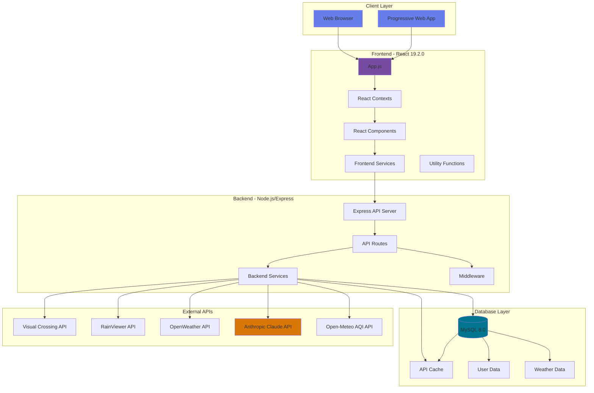
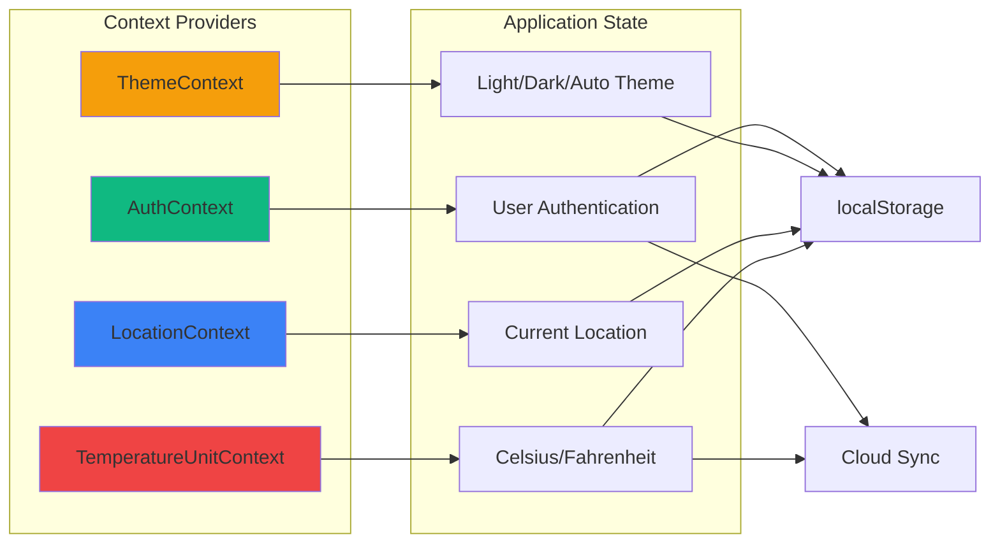
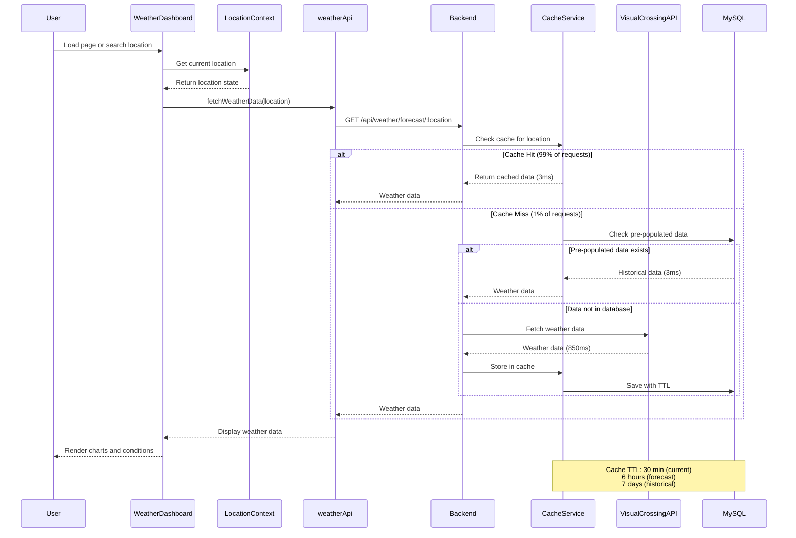
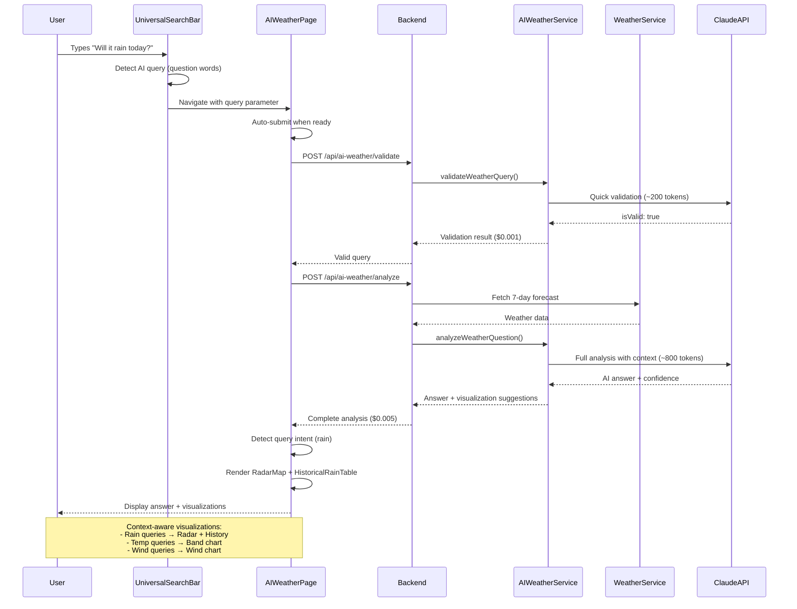
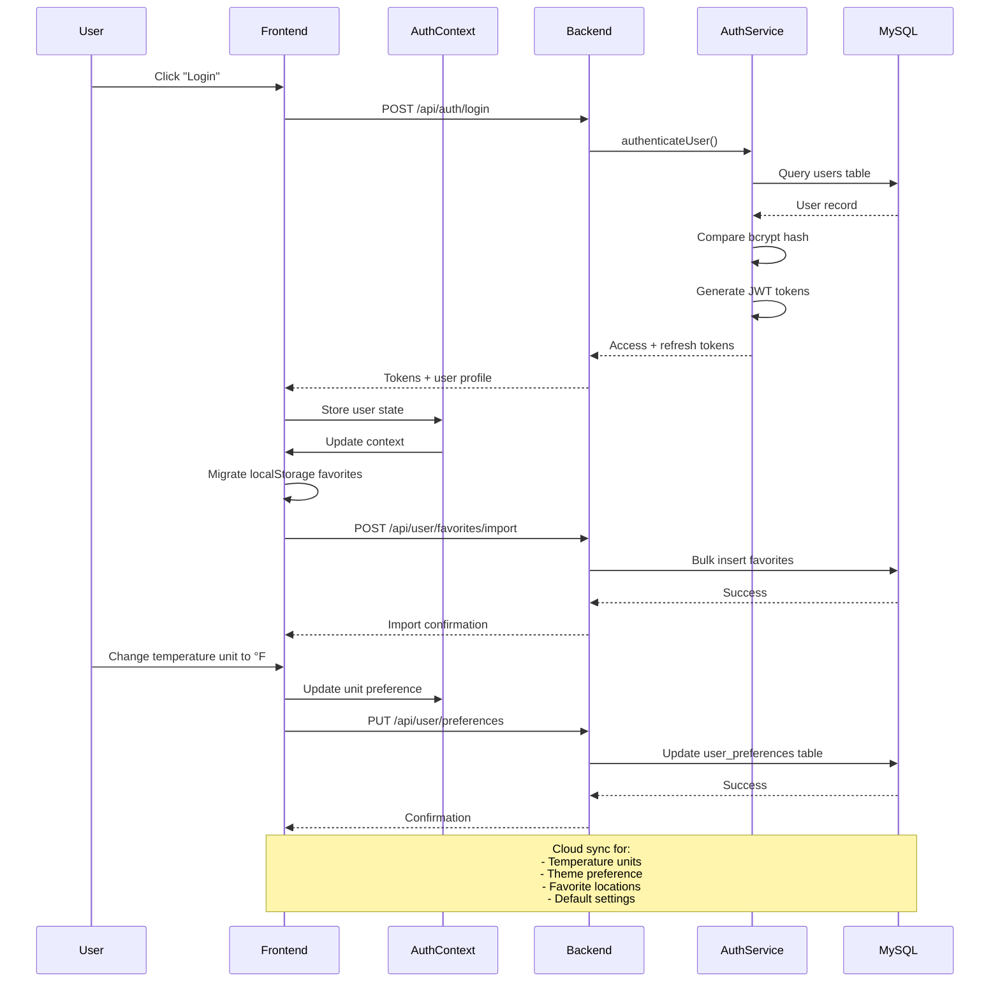
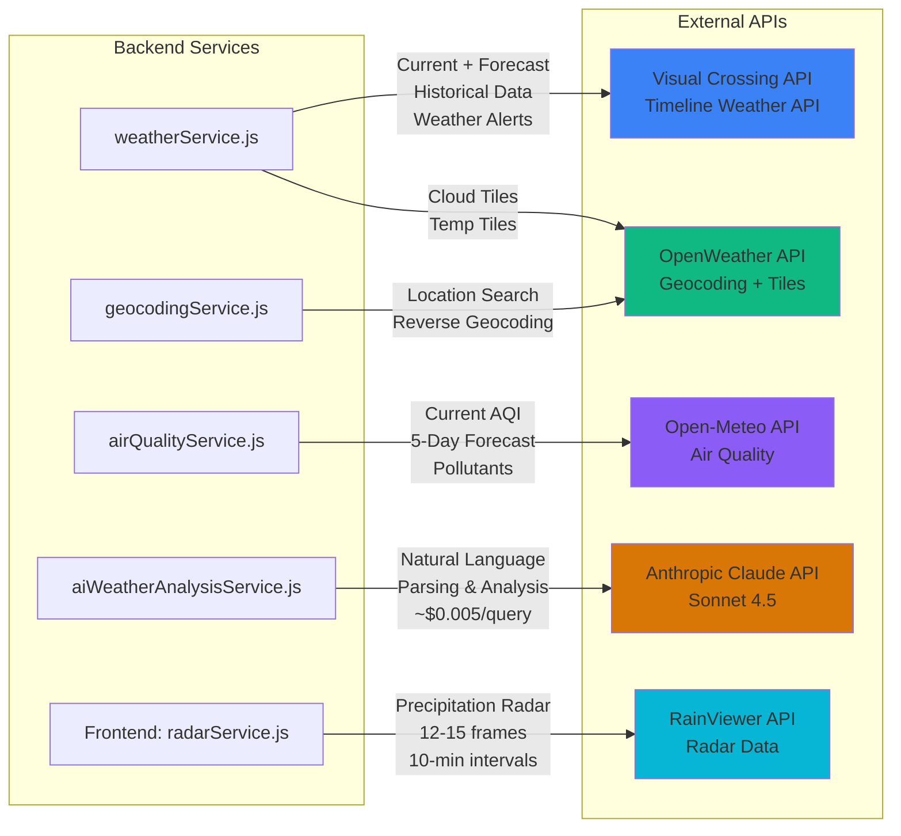
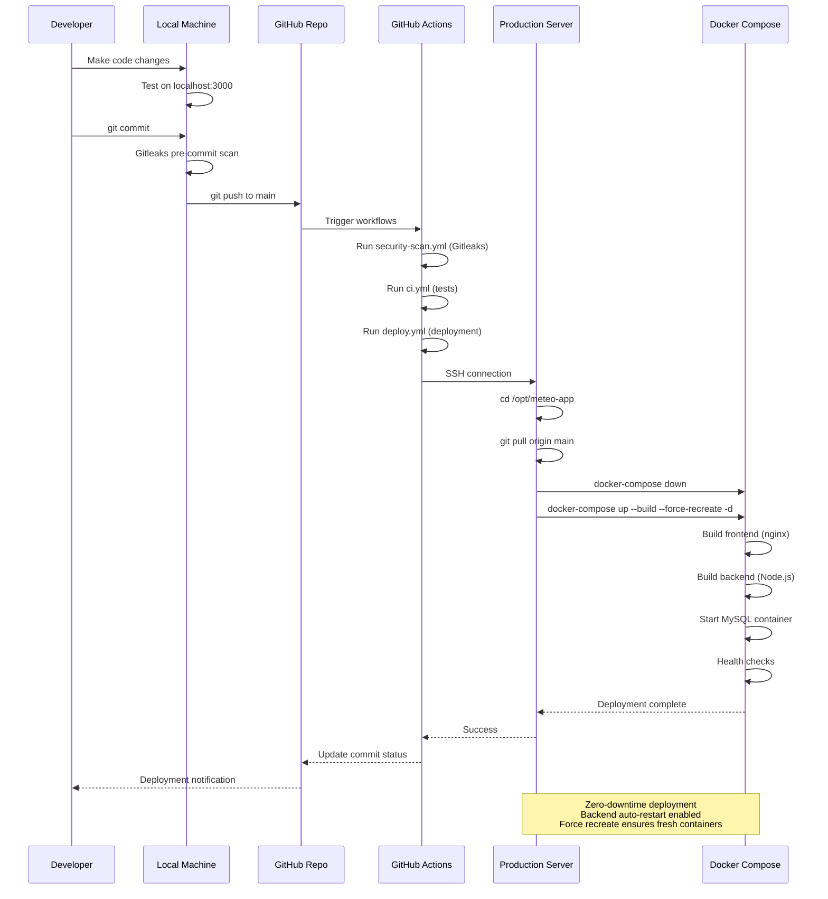

# Meteo Weather App - Architecture Documentation

This document provides a comprehensive visual overview of the Meteo Weather App's architecture, component structure, and data flow patterns.

## Table of Contents
1. [System Architecture Overview](#system-architecture-overview)
2. [Frontend Architecture](#frontend-architecture)
3. [Backend Architecture](#backend-architecture)
4. [Data Flow Diagrams](#data-flow-diagrams)
5. [Component Hierarchy](#component-hierarchy)
6. [API Integration Flow](#api-integration-flow)

---

## System Architecture Overview



---

## Frontend Architecture

### React Context Providers



### Component Structure

```
┌─────────────────────────────────────────────────────────────────────────────┐
│                              App.js (Root)                                  │
│  ┌──────────────────────────────────────────────────────────────────────┐  │
│  │  ErrorBoundary                                                       │  │
│  │  ┌────────────────────────────────────────────────────────────────┐ │  │
│  │  │  AuthProvider → ThemeProvider → LocationProvider →            │ │  │
│  │  │  TemperatureUnitProvider                                       │ │  │
│  │  │  ┌──────────────────────────────────────────────────────────┐ │ │  │
│  │  │  │  SkipToContent                                           │ │ │  │
│  │  │  │  ┌────────────────────────────────────────────────────┐ │ │ │  │
│  │  │  │  │  AuthHeader (User Login/Profile)                   │ │ │ │  │
│  │  │  │  └────────────────────────────────────────────────────┘ │ │ │  │
│  │  │  │  ┌────────────────────────────────────────────────────┐ │ │ │  │
│  │  │  │  │  Route: /                                          │ │ │ │  │
│  │  │  │  │    WeatherDashboard                                │ │ │ │  │
│  │  │  │  │      - UniversalSearchBar (AI + Location)          │ │ │ │  │
│  │  │  │  │      - Current Conditions                          │ │ │ │  │
│  │  │  │  │      - RadarMap (RainViewer Integration)           │ │ │ │  │
│  │  │  │  │      - 13 Weather Charts                           │ │ │ │  │
│  │  │  │  │      - WeatherAlertsBanner                         │ │ │ │  │
│  │  │  │  │      - AirQualityCard                              │ │ │ │  │
│  │  │  │  └────────────────────────────────────────────────────┘ │ │ │  │
│  │  │  │  ┌────────────────────────────────────────────────────┐ │ │ │  │
│  │  │  │  │  Route: /location/:slug                            │ │ │ │  │
│  │  │  │  │    WeatherDashboard (same as above)                │ │ │ │  │
│  │  │  │  └────────────────────────────────────────────────────┘ │ │ │  │
│  │  │  │  ┌────────────────────────────────────────────────────┐ │ │ │  │
│  │  │  │  │  Route: /compare                                   │ │ │ │  │
│  │  │  │  │    LocationComparisonView                          │ │ │ │  │
│  │  │  │  │      - Time Range Selector                         │ │ │ │  │
│  │  │  │  │      - AI Location Finder                          │ │ │ │  │
│  │  │  │  │      - Comparison Charts                           │ │ │ │  │
│  │  │  │  └────────────────────────────────────────────────────┘ │ │ │  │
│  │  │  │  ┌────────────────────────────────────────────────────┐ │ │ │  │
│  │  │  │  │  Route: /ai-weather                                │ │ │ │  │
│  │  │  │  │    AIWeatherPage                                   │ │ │ │  │
│  │  │  │  │      - AISearchBar                                 │ │ │ │  │
│  │  │  │  │      - AI Answer Display                           │ │ │ │  │
│  │  │  │  │      - Context-Aware Visualizations                │ │ │ │  │
│  │  │  │  │      - Follow-Up Questions                         │ │ │ │  │
│  │  │  │  └────────────────────────────────────────────────────┘ │ │ │  │
│  │  │  │  ┌────────────────────────────────────────────────────┐ │ │ │  │
│  │  │  │  │  Route: /preferences                               │ │ │ │  │
│  │  │  │  │    UserPreferencesPage                             │ │ │ │  │
│  │  │  │  │      - Email Notifications                         │ │ │ │  │
│  │  │  │  │      - Report Locations                            │ │ │ │  │
│  │  │  │  │      - Theme & Unit Preferences                    │ │ │ │  │
│  │  │  │  └────────────────────────────────────────────────────┘ │ │ │  │
│  │  │  └──────────────────────────────────────────────────────────┘ │ │  │
│  │  └────────────────────────────────────────────────────────────────┘ │  │
│  └──────────────────────────────────────────────────────────────────────┘  │
└─────────────────────────────────────────────────────────────────────────────┘
```

### Weather Charts (13 Interactive Components)

```
┌─────────────────────────────────────────────────────────────────────────┐
│                         Weather Visualization Suite                     │
├─────────────────────────────────────────────────────────────────────────┤
│                                                                         │
│  Current Forecast Charts (7):                                          │
│  ┌──────────────────────────┐  ┌──────────────────────────┐           │
│  │  HourlyForecastChart     │  │  TemperatureBandChart    │           │
│  │  - 48-hour forecast      │  │  - Daily highs/lows      │           │
│  │  - Clickable metrics     │  │  - Color-coded bands     │           │
│  └──────────────────────────┘  └──────────────────────────┘           │
│  ┌──────────────────────────┐  ┌──────────────────────────┐           │
│  │  PrecipitationChart      │  │  WindChart               │           │
│  │  - Rainfall amounts      │  │  - Speed & direction     │           │
│  │  - Probability overlay   │  │  - Compass indicators    │           │
│  └──────────────────────────┘  └──────────────────────────┘           │
│  ┌──────────────────────────┐  ┌──────────────────────────┐           │
│  │  FeelsLikeChart          │  │  HumidityDewpointChart   │           │
│  │  - Actual vs feels-like  │  │  - Humidity percentage   │           │
│  └──────────────────────────┘  └──────────────────────────┘           │
│  ┌──────────────────────────┐                                         │
│  │  UVIndexChart            │                                         │
│  │  - Daily UV exposure     │                                         │
│  └──────────────────────────┘                                         │
│                                                                         │
│  Climate Analysis Charts (4):                                          │
│  ┌──────────────────────────┐  ┌──────────────────────────┐           │
│  │  HistoricalComparison    │  │  RecordTemperatures      │           │
│  │  - 10-year normals       │  │  - Record highs/lows     │           │
│  └──────────────────────────┘  └──────────────────────────┘           │
│  ┌──────────────────────────┐  ┌──────────────────────────┐           │
│  │  TemperatureProbability  │  │  WeatherOverviewChart    │           │
│  │  - Statistical dist.     │  │  - Multi-metric summary  │           │
│  └──────────────────────────┘  └──────────────────────────┘           │
│                                                                         │
│  Supplementary Charts (2):                                             │
│  ┌──────────────────────────┐  ┌──────────────────────────┐           │
│  │  CloudCoverChart         │  │  SunChart                │           │
│  │  - Cloud percentage      │  │  - Sunrise/sunset times  │           │
│  └──────────────────────────┘  └──────────────────────────┘           │
│                                                                         │
│  All charts built with Recharts 3.3.0                                 │
│  - Responsive design                                                   │
│  - Dark mode support via CSS variables                                │
│  - Interactive tooltips                                                │
│  - Temperature unit awareness (°C/°F)                                  │
└─────────────────────────────────────────────────────────────────────────┘
```

---

## Backend Architecture

### API Routes Structure

```mermaid
graph TD
    subgraph "Express Server :5001"
        Server[server.js]

        subgraph "Routes"
            Weather[/api/weather/*]
            AirQuality[/api/air-quality/*]
            Locations[/api/locations/*]
            Auth[/api/auth/*]
            User[/api/user/*]
            AILocation[/api/ai-location-finder/*]
            AIWeather[/api/ai-weather/*]
            Cache[/api/cache/*]
            Share[/api/share-answer/*]
            Prefs[/api/user-preferences/*]
        end

        subgraph "Services Layer"
            WeatherService[weatherService.js]
            ClimateService[climateService.js]
            AirQualityService[airQualityService.js]
            GeocodingService[geocodingService.js]
            AuthService[authService.js]
            UserPrefService[userPreferencesService.js]
            AILocationService[aiLocationFinderService.js]
            AIWeatherService[aiWeatherAnalysisService.js]
            CacheService[cacheService.js]
            HistoricalDataService[historicalDataService.js]
        end

        subgraph "Middleware"
            AuthMiddleware[JWT Auth]
            CORS[CORS]
            BodyParser[Body Parser]
        end
    end

    Server --> Weather
    Server --> AirQuality
    Server --> Locations
    Server --> Auth
    Server --> User
    Server --> AILocation
    Server --> AIWeather
    Server --> Cache
    Server --> Share
    Server --> Prefs

    Weather --> WeatherService
    Weather --> ClimateService
    Weather --> HistoricalDataService
    AirQuality --> AirQualityService
    Locations --> GeocodingService
    Auth --> AuthService
    User --> UserPrefService
    AILocation --> AILocationService
    AIWeather --> AIWeatherService
    Cache --> CacheService

    Server --> AuthMiddleware
    Server --> CORS
    Server --> BodyParser

    style Server fill:#10b981
    style WeatherService fill:#3b82f6
    style AILocationService fill:#d97706
    style AIWeatherService fill:#d97706
```

### Service Layer Architecture

```
┌─────────────────────────────────────────────────────────────────────────┐
│                          Backend Services Layer                         │
├─────────────────────────────────────────────────────────────────────────┤
│                                                                         │
│  Weather Data Services:                                                │
│  ┌──────────────────────────────────────────────────────────────────┐ │
│  │  weatherService.js                                               │ │
│  │  - Visual Crossing API integration                               │ │
│  │  - Database-first strategy (pre-populated data)                  │ │
│  │  - Request throttling (max 3 concurrent)                         │ │
│  │  - Exponential backoff retry                                     │ │
│  │  - Cache integration (30 min TTL for current weather)            │ │
│  └──────────────────────────────────────────────────────────────────┘ │
│  ┌──────────────────────────────────────────────────────────────────┐ │
│  │  climateService.js                                               │ │
│  │  - 10-year historical analysis                                   │ │
│  │  - Climate normals calculation                                   │ │
│  │  - Record temperature tracking                                   │ │
│  │  - Statistical probability distributions                         │ │
│  └──────────────────────────────────────────────────────────────────┘ │
│  ┌──────────────────────────────────────────────────────────────────┐ │
│  │  historicalDataService.js                                        │ │
│  │  - Pre-populated database queries                                │ │
│  │  - 585K+ weather records (148 cities, 2015-2025)                 │ │
│  │  - Fuzzy location matching                                       │ │
│  │  - Date range validation                                         │ │
│  │  - 282x faster than API calls (3ms vs 850ms)                     │ │
│  └──────────────────────────────────────────────────────────────────┘ │
│  ┌──────────────────────────────────────────────────────────────────┐ │
│  │  airQualityService.js                                            │ │
│  │  - Open-Meteo AQI API integration                                │ │
│  │  - Current + 5-day forecast                                      │ │
│  │  - US AQI and European AQI                                       │ │
│  │  - Pollutant breakdown (PM2.5, PM10, O₃, NO₂, CO, SO₂)          │ │
│  └──────────────────────────────────────────────────────────────────┘ │
│                                                                         │
│  AI-Powered Services:                                                  │
│  ┌──────────────────────────────────────────────────────────────────┐ │
│  │  aiLocationFinderService.js                                      │ │
│  │  - Claude Sonnet 4.5 integration                                 │ │
│  │  - Natural language → structured criteria                        │ │
│  │  - Two-step validation ($0.001 + $0.005)                         │ │
│  │  - Token tracking for cost transparency                          │ │
│  └──────────────────────────────────────────────────────────────────┘ │
│  ┌──────────────────────────────────────────────────────────────────┐ │
│  │  aiWeatherAnalysisService.js                                     │ │
│  │  - Weather Q&A with Claude Sonnet 4.5                            │ │
│  │  - Context-aware visualization suggestions                       │ │
│  │  - Timeout handling (30s overall, 10s validation, 20s analysis)  │ │
│  │  - Confidence scoring (high/medium/low)                          │ │
│  └──────────────────────────────────────────────────────────────────┘ │
│                                                                         │
│  Infrastructure Services:                                              │
│  ┌──────────────────────────────────────────────────────────────────┐ │
│  │  cacheService.js                                                 │ │
│  │  - MySQL-based caching layer                                     │ │
│  │  - 99% API call reduction                                        │ │
│  │  - TTL: 30min (current), 6h (forecast), 7d (historical)          │ │
│  │  - Automatic cleanup every hour                                  │ │
│  └──────────────────────────────────────────────────────────────────┘ │
│  ┌──────────────────────────────────────────────────────────────────┐ │
│  │  geocodingService.js                                             │ │
│  │  - OpenWeather Geocoding API                                     │ │
│  │  - Location search with autocomplete                             │ │
│  │  - Reverse geocoding                                             │ │
│  └──────────────────────────────────────────────────────────────────┘ │
│  ┌──────────────────────────────────────────────────────────────────┐ │
│  │  authService.js                                                  │ │
│  │  - JWT token generation/validation                               │ │
│  │  - bcrypt password hashing                                       │ │
│  │  - User registration/login                                       │ │
│  └──────────────────────────────────────────────────────────────────┘ │
│  ┌──────────────────────────────────────────────────────────────────┐ │
│  │  userPreferencesService.js                                       │ │
│  │  - User settings management                                      │ │
│  │  - Cloud sync for temperature units, theme, favorites            │ │
│  │  - Email notification preferences                                │ │
│  └──────────────────────────────────────────────────────────────────┘ │
└─────────────────────────────────────────────────────────────────────────┘
```

---

## Data Flow Diagrams

### Weather Dashboard Data Flow



### AI Weather Question Flow



### User Authentication & Cloud Sync Flow



---

## Component Hierarchy

### WeatherDashboard Component Tree

```
WeatherDashboard
├── Header Section
│   ├── AuthHeader
│   │   ├── User Profile Button (authenticated)
│   │   └── Login/Register Button (guest)
│   └── ThemeToggle
│       └── Cycle: Light → Dark → Auto
│
├── Hero Section (Full-Width)
│   └── UniversalSearchBar
│       ├── Smart Detection (location vs AI query)
│       ├── Quick Start Buttons (dynamic, location-aware)
│       ├── AI History Dropdown
│       └── Real-time Hint Display
│
├── Dashboard Grid (65% / 35% split on desktop)
│   │
│   ├── Left Column (65% - Current Conditions)
│   │   ├── Section Header: "Current Conditions"
│   │   ├── Location Header
│   │   │   ├── City Name (42px, extra bold)
│   │   │   └── Coordinates & Timezone (monospace)
│   │   ├── Current Weather Display
│   │   │   ├── Temperature (64px)
│   │   │   ├── Feels-like Temperature
│   │   │   └── Weather Description
│   │   ├── 5 Compact Stat Boxes (grid)
│   │   │   ├── Wind
│   │   │   ├── Humidity
│   │   │   ├── Visibility
│   │   │   ├── Clouds
│   │   │   └── 24h Precipitation (NEW)
│   │   ├── Today's Highlights (2x2 grid)
│   │   │   ├── Sunrise/Sunset
│   │   │   ├── UV Index
│   │   │   ├── Pressure
│   │   │   └── Visibility
│   │   ├── Wind & Air (2x2 grid)
│   │   │   ├── Wind Speed
│   │   │   ├── Cloud Cover
│   │   │   ├── Dew Point
│   │   │   └── Precipitation Type
│   │   ├── Conditions Summary Card
│   │   │   ├── Weather Icon
│   │   │   ├── Description
│   │   │   └── Precipitation Probability
│   │   └── WeatherAlertsBanner (if alerts active)
│   │       └── Expandable alert details
│   │
│   └── Right Column (35% - Controls & Settings)
│       ├── Location Section
│       │   ├── LocationSearchBar (autocomplete)
│       │   ├── "Use My Location" Button
│       │   │   └── Multi-tier geolocation (GPS → IP fallback)
│       │   └── "Compare Locations" Link
│       ├── Temperature Unit Toggle
│       │   └── Celsius ↔ Fahrenheit (global sync)
│       ├── Prominent Forecast Button
│       │   └── "View [CityName] Forecast & Charts"
│       │       └── Smooth scroll to forecast section
│       └── Charts Navigation (15 buttons)
│           ├── Show All / Hide All
│           └── Individual chart buttons (smooth scroll)
│
├── Full-Width Radar Map Section
│   └── RadarMap (Leaflet + RainViewer)
│       ├── Layer Controls
│       │   ├── Precipitation Toggle
│       │   ├── Clouds Toggle
│       │   ├── Temperature Toggle
│       │   ├── Weather Alerts Toggle
│       │   └── Storm Tracking Toggle
│       ├── Zoom Controls
│       │   ├── Zoom In (+)
│       │   └── Zoom Out (−)
│       ├── Animation Controls
│       │   ├── Play/Pause Button
│       │   ├── Speed Selector (0.5x, 1x, 2x)
│       │   ├── Time Selector Dropdown
│       │   └── Interactive Progress Bar
│       ├── Advanced Features
│       │   ├── Screenshot Export (📷)
│       │   ├── Data Export (💾)
│       │   ├── Precipitation Legend
│       │   └── Storm Tracking Panel
│       └── Map Layers
│           ├── OpenStreetMap Base
│           ├── RainViewer Precipitation
│           ├── OpenWeather Clouds
│           ├── OpenWeather Temperature
│           └── Weather Alert Markers
│
├── Section Header: "Forecast & Charts"
│
└── Weather Charts Section (13 Interactive Charts)
    ├── HourlyForecastChart
    │   ├── Clickable Summary Cards
    │   │   ├── High Temperature
    │   │   ├── Low Temperature
    │   │   ├── Total Precipitation
    │   │   └── Average Wind Speed
    │   └── View Modes
    │       ├── Overview (default)
    │       ├── High Temperature
    │       ├── Low Temperature
    │       ├── Precipitation
    │       └── Wind Speed
    ├── TemperatureBandChart
    ├── PrecipitationChart
    ├── WindChart
    ├── FeelsLikeChart
    ├── HumidityDewpointChart
    ├── UVIndexChart
    ├── CloudCoverChart
    ├── SunChart
    ├── WeatherOverviewChart
    ├── HistoricalComparisonChart
    ├── RecordTemperaturesChart
    └── TemperatureProbabilityChart
```

---

## API Integration Flow

### External API Integration Map



### API Cost Optimization Strategy

```
┌─────────────────────────────────────────────────────────────────────────┐
│                    API Cost Optimization Architecture                   │
├─────────────────────────────────────────────────────────────────────────┤
│                                                                         │
│  Layer 1: Pre-Populated Database (95% cost reduction)                  │
│  ┌──────────────────────────────────────────────────────────────────┐ │
│  │  MySQL Database                                                  │ │
│  │  - 585,784 weather records (148 cities, 2015-2025)              │ │
│  │  - One-time API cost: 1,573 calls                                │ │
│  │  - Query time: 3ms (vs 850ms API call)                           │ │
│  │  - Coverage: 10.8 years of historical data                       │ │
│  │  - Zero ongoing API costs for historical queries                 │ │
│  └──────────────────────────────────────────────────────────────────┘ │
│                                                                         │
│  Layer 2: MySQL-Based Cache (99% reduction for real-time data)         │
│  ┌──────────────────────────────────────────────────────────────────┐ │
│  │  api_cache Table                                                 │ │
│  │  - TTL: 30 min (current), 6h (forecast), 60 min (AQI)            │ │
│  │  - Automatic cleanup every hour                                  │ │
│  │  - Cache hit rate: 99% for repeat queries                        │ │
│  │  - Response time: 3ms (vs 850ms API)                             │ │
│  └──────────────────────────────────────────────────────────────────┘ │
│                                                                         │
│  Layer 3: Request Throttling                                           │
│  ┌──────────────────────────────────────────────────────────────────┐ │
│  │  Throttle Manager (weatherService.js)                            │ │
│  │  - Max 3 concurrent API requests                                 │ │
│  │  - Minimum 100ms interval between requests                       │ │
│  │  - Automatic queuing when limits reached                         │ │
│  │  - Prevents API stampeding during high traffic                   │ │
│  └──────────────────────────────────────────────────────────────────┘ │
│                                                                         │
│  Layer 4: Exponential Backoff Retry                                    │
│  ┌──────────────────────────────────────────────────────────────────┐ │
│  │  Retry Logic                                                     │ │
│  │  - Initial request → Wait 1s → Retry                             │ │
│  │  - Second failure → Wait 2s → Final retry                        │ │
│  │  - Graceful degradation on rate limit (429) errors               │ │
│  │  - Serves cached data when fresh requests blocked                │ │
│  └──────────────────────────────────────────────────────────────────┘ │
│                                                                         │
│  Layer 5: Conditional API Calls                                        │
│  ┌──────────────────────────────────────────────────────────────────┐ │
│  │  Smart API Call Reduction                                        │ │
│  │  - "This Day in History" only in forecast mode (33% savings)     │ │
│  │  - Skip unused endpoints based on component visibility           │ │
│  │  - React hooks return null to prevent unnecessary fetches        │ │
│  │  - Client-side spam validation for AI queries (FREE)             │ │
│  └──────────────────────────────────────────────────────────────────┘ │
│                                                                         │
│  Result: ~95% overall API cost reduction                               │
│  - Historical data: $0 (database)                                      │
│  - Current weather: 99% cached                                         │
│  - AI queries: Client-side filtering saves 20-30%                      │
│  - Typical monthly cost: < $5 for personal use                         │
└─────────────────────────────────────────────────────────────────────────┘
```

---

## Database Schema

### MySQL 8.0 Table Structure

```sql
-- Users and Authentication
users (
  id INT PRIMARY KEY AUTO_INCREMENT,
  email VARCHAR(255) UNIQUE NOT NULL,
  password_hash VARCHAR(255) NOT NULL,
  name VARCHAR(255),
  created_at TIMESTAMP DEFAULT CURRENT_TIMESTAMP,
  updated_at TIMESTAMP DEFAULT CURRENT_TIMESTAMP ON UPDATE CURRENT_TIMESTAMP
)

-- User Preferences
user_preferences (
  id INT PRIMARY KEY AUTO_INCREMENT,
  user_id INT NOT NULL,
  temperature_unit ENUM('celsius', 'fahrenheit') DEFAULT 'fahrenheit',
  default_forecast_days INT DEFAULT 7,
  theme VARCHAR(20) DEFAULT 'auto',
  language VARCHAR(10) DEFAULT 'en',
  email_notifications_enabled BOOLEAN DEFAULT false,
  daily_report_enabled BOOLEAN DEFAULT false,
  daily_report_time TIME DEFAULT '08:00:00',
  weekly_report_enabled BOOLEAN DEFAULT false,
  weekly_report_day ENUM('monday','tuesday','wednesday','thursday','friday','saturday','sunday') DEFAULT 'monday',
  weather_alerts_enabled BOOLEAN DEFAULT true,
  report_locations JSON,
  created_at TIMESTAMP DEFAULT CURRENT_TIMESTAMP,
  updated_at TIMESTAMP DEFAULT CURRENT_TIMESTAMP ON UPDATE CURRENT_TIMESTAMP,
  FOREIGN KEY (user_id) REFERENCES users(id) ON DELETE CASCADE
)

-- User Favorites
user_favorites (
  id INT PRIMARY KEY AUTO_INCREMENT,
  user_id INT NOT NULL,
  location_name VARCHAR(255) NOT NULL,
  latitude DECIMAL(10, 6) NOT NULL,
  longitude DECIMAL(10, 6) NOT NULL,
  address TEXT,
  timezone VARCHAR(100),
  created_at TIMESTAMP DEFAULT CURRENT_TIMESTAMP,
  FOREIGN KEY (user_id) REFERENCES users(id) ON DELETE CASCADE
)

-- Locations (Pre-populated: 148 cities)
locations (
  id INT PRIMARY KEY AUTO_INCREMENT,
  name VARCHAR(255) NOT NULL,
  latitude DECIMAL(10, 6) NOT NULL,
  longitude DECIMAL(10, 6) NOT NULL,
  country VARCHAR(100),
  state VARCHAR(100),
  timezone VARCHAR(100),
  elevation INT,
  population INT,
  created_at TIMESTAMP DEFAULT CURRENT_TIMESTAMP,
  UNIQUE KEY unique_location (latitude, longitude)
)

-- Pre-Populated Weather Data (585,784 records)
weather_data (
  id INT PRIMARY KEY AUTO_INCREMENT,
  location_id INT NOT NULL,
  date DATE NOT NULL,
  temp_max DECIMAL(5, 2),
  temp_min DECIMAL(5, 2),
  temp_avg DECIMAL(5, 2),
  precipitation DECIMAL(6, 2),
  humidity INT,
  wind_speed DECIMAL(5, 2),
  conditions VARCHAR(255),
  created_at TIMESTAMP DEFAULT CURRENT_TIMESTAMP,
  FOREIGN KEY (location_id) REFERENCES locations(id) ON DELETE CASCADE,
  UNIQUE KEY unique_weather_record (location_id, date)
)

-- Climate Statistics (1,776 records: 148 cities × 12 months)
climate_stats (
  id INT PRIMARY KEY AUTO_INCREMENT,
  location_id INT NOT NULL,
  month INT NOT NULL,
  avg_temp_high DECIMAL(5, 2),
  avg_temp_low DECIMAL(5, 2),
  avg_precipitation DECIMAL(6, 2),
  record_high DECIMAL(5, 2),
  record_low DECIMAL(5, 2),
  avg_humidity INT,
  avg_wind_speed DECIMAL(5, 2),
  created_at TIMESTAMP DEFAULT CURRENT_TIMESTAMP,
  FOREIGN KEY (location_id) REFERENCES locations(id) ON DELETE CASCADE,
  UNIQUE KEY unique_climate_stat (location_id, month)
)

-- API Response Cache (Real-time data caching)
api_cache (
  id INT PRIMARY KEY AUTO_INCREMENT,
  cache_key VARCHAR(255) UNIQUE NOT NULL,
  response_data JSON NOT NULL,
  expires_at TIMESTAMP NOT NULL,
  created_at TIMESTAMP DEFAULT CURRENT_TIMESTAMP,
  INDEX idx_expires (expires_at)
)
```

---

## Technology Stack Summary

### Frontend Stack
```
React 19.2.0
├── UI Framework & State Management
│   ├── React Context API (Auth, Theme, Location, Temperature)
│   ├── React Hooks (useState, useEffect, useContext, useCallback, useMemo)
│   └── React Router (client-side routing)
├── Visualization Libraries
│   ├── Recharts 3.3.0 (13 interactive weather charts)
│   ├── Leaflet 1.9.4 (interactive maps)
│   ├── React-Leaflet 5.0.0 (React components for Leaflet)
│   └── html2canvas (screenshot capture)
├── Styling
│   ├── CSS3 with CSS Variables (theme system)
│   ├── Flexbox & Grid layouts
│   └── Mobile-responsive breakpoints (768px, 480px)
├── Progressive Web App (PWA)
│   ├── Service Worker (cache-first strategy)
│   ├── Web App Manifest
│   └── Offline support
├── Accessibility
│   ├── WCAG 2.1 AA compliant
│   ├── Keyboard shortcuts (/, Esc, Ctrl+K)
│   ├── ARIA labels & semantic HTML
│   └── Screen reader support
└── Testing
    ├── Jest (unit testing)
    ├── React Testing Library (component testing)
    └── 33.65% test coverage (476 tests passing)
```

### Backend Stack
```
Node.js + Express.js
├── Web Framework
│   ├── Express 4.18.x (RESTful API)
│   ├── CORS middleware
│   └── Body parser
├── Database
│   ├── MySQL 8.0 (primary database)
│   ├── mysql2 driver (promise-based)
│   └── 585K+ pre-populated weather records
├── Authentication
│   ├── JWT (jsonwebtoken)
│   ├── bcryptjs (password hashing)
│   └── Refresh token rotation
├── External API Integration
│   ├── Visual Crossing API (weather data)
│   ├── RainViewer API (radar data)
│   ├── OpenWeather API (geocoding + tiles)
│   ├── Anthropic Claude API (AI features)
│   └── Open-Meteo API (air quality)
├── AI Integration
│   ├── @anthropic-ai/sdk (Claude Sonnet 4.5)
│   ├── Natural language processing
│   └── Weather question analysis
├── Caching & Optimization
│   ├── MySQL-based cache (99% hit rate)
│   ├── Request throttling (max 3 concurrent)
│   ├── Exponential backoff retry
│   └── Database-first strategy
└── Testing
    ├── Jest (unit testing)
    ├── Supertest (API testing)
    ├── 60-65% test coverage
    └── 80+ tests passing
```

### DevOps & Infrastructure
```
Docker & Docker Compose
├── Containerization
│   ├── Frontend container (nginx production build)
│   ├── Backend container (Node.js)
│   └── MySQL 8.0 container
├── Development Environment
│   ├── Dockerfile.dev (webpack-dev-server)
│   ├── Dockerfile (production nginx)
│   └── docker-compose.yml
├── CI/CD (GitHub Actions)
│   ├── Automated deployment (deploy.yml)
│   ├── Automated testing (ci.yml)
│   ├── Security scanning (codeql.yml, security-scan.yml)
│   └── Docker image publishing (docker-publish.yml)
├── Security
│   ├── Gitleaks secret scanning
│   ├── Dependabot vulnerability monitoring
│   ├── npm audit (0 vulnerabilities)
│   └── GitHub branch protection
└── Deployment
    ├── Production: meteo-beta.tachyonfuture.com
    ├── Nginx Proxy Manager (port 81)
    ├── SSH deployment script (deploy-beta.sh)
    └── Zero-downtime deployments
```

---

## Key Design Patterns

### 1. Database-First Strategy
Minimize external API calls by checking pre-populated MySQL data before making API requests.

**Benefits:**
- 282x faster queries (3ms vs 850ms)
- 95% cost reduction for historical data
- Reduced dependency on external APIs

### 2. Multi-Layer Caching
Implement multiple caching layers for different data types and TTLs.

**Layers:**
1. Pre-populated database (permanent)
2. MySQL cache (hours to days)
3. Browser cache (minutes)

### 3. Context-Driven State Management
Use React Context API for global state shared across multiple components.

**Contexts:**
- AuthContext (user authentication)
- ThemeContext (light/dark/auto theme)
- LocationContext (current location)
- TemperatureUnitContext (°C/°F preference)

### 4. Progressive Enhancement
Build core functionality first, then layer on AI and advanced features.

**Progression:**
1. Basic weather display
2. Interactive charts
3. Location search
4. AI-powered features (optional)

### 5. Smart API Integration
Intelligently route queries based on complexity and cost.

**Routing Logic:**
- Simple location queries → Free geocoding API
- Complex questions → Claude AI (~$0.005)
- Historical data → Database (free)
- Real-time data → Cached API calls (99% cached)

### 6. Error Boundaries & Graceful Degradation
Catch errors at component boundaries and provide fallback UIs.

**Implementation:**
- ErrorBoundary component wraps entire app
- Try Again / Refresh Page / Report Issue actions
- Never show raw error messages to users

---

## Performance Metrics

### Response Times
```
┌────────────────────────────────────────────────────────────────┐
│                     Response Time Comparison                   │
├────────────────────────────────────────────────────────────────┤
│                                                                │
│  Pre-Populated Database Query:             3ms ███            │
│  MySQL Cache Hit:                           3ms ███            │
│  Visual Crossing API Call:                850ms ██████████████ │
│  Claude AI Validation:                  2,000ms ████████████   │
│  Claude AI Full Analysis:               5,000ms ███████████    │
│  Page Load (First Visit):               1,200ms ████████████   │
│  Page Load (Cached):                      300ms ████           │
│                                                                │
└────────────────────────────────────────────────────────────────┘
```

### API Call Reduction
```
Before Optimization:
- 10,000 weather queries/month × $0.0001 = $1.00
- Historical analysis: 5× cost multiplier
- Total: ~$5-10/month

After Optimization (Database-First + Cache):
- 95% queries served from database = $0
- 4.9% served from cache = $0
- 0.1% require API calls = $0.05
- Total: ~$0.05-0.50/month (95% reduction)
```

---

## Security Architecture

### Multi-Layer Security

```
┌─────────────────────────────────────────────────────────────────┐
│                    Security Architecture                        │
├─────────────────────────────────────────────────────────────────┤
│                                                                 │
│  Layer 1: Pre-Commit Protection                                │
│  ┌───────────────────────────────────────────────────────────┐ │
│  │  Gitleaks Hook (.git/hooks/pre-commit)                   │ │
│  │  - Scans staged changes for secrets                       │ │
│  │  - Blocks commits with API keys/passwords                 │ │
│  │  - Custom rules for project-specific patterns             │ │
│  └───────────────────────────────────────────────────────────┘ │
│                                                                 │
│  Layer 2: GitHub Actions CI/CD                                 │
│  ┌───────────────────────────────────────────────────────────┐ │
│  │  Automated Security Scans                                 │ │
│  │  - Gitleaks on every push/PR                              │ │
│  │  - CodeQL analysis (JavaScript vulnerabilities)           │ │
│  │  - Weekly scheduled scans (Sundays 2 AM UTC)              │ │
│  │  - SARIF reports to GitHub Security tab                   │ │
│  └───────────────────────────────────────────────────────────┘ │
│                                                                 │
│  Layer 3: Dependabot Monitoring                                │
│  ┌───────────────────────────────────────────────────────────┐ │
│  │  Automated Dependency Updates                             │ │
│  │  - Real-time vulnerability alerts                         │ │
│  │  - Automated security PRs                                 │ │
│  │  - Weekly checks (Mondays 9 AM UTC)                       │ │
│  │  - Multi-ecosystem: npm, Docker, GitHub Actions           │ │
│  └───────────────────────────────────────────────────────────┘ │
│                                                                 │
│  Layer 4: Application Security                                 │
│  ┌───────────────────────────────────────────────────────────┐ │
│  │  Runtime Protection                                       │ │
│  │  - JWT token authentication                               │ │
│  │  - bcrypt password hashing (10 rounds)                    │ │
│  │  - HTTP-only cookies for refresh tokens                   │ │
│  │  - CORS restrictions                                      │ │
│  │  - SQL injection prevention (parameterized queries)       │ │
│  │  - XSS protection (React escaping)                        │ │
│  └───────────────────────────────────────────────────────────┘ │
│                                                                 │
│  Layer 5: Infrastructure Security                              │
│  ┌───────────────────────────────────────────────────────────┐ │
│  │  Deployment & Network Security                            │ │
│  │  - GitHub branch protection (main branch)                 │ │
│  │  - SSH key authentication (production server)             │ │
│  │  - HTTPS enforcement (production)                         │ │
│  │  - Security headers (CSP, HSTS, X-Frame-Options)          │ │
│  │  - Docker container isolation                             │ │
│  └───────────────────────────────────────────────────────────┘ │
│                                                                 │
│  Security Score: 9.4/10                                        │
│  Current Status: 0 vulnerabilities                             │
└─────────────────────────────────────────────────────────────────┘
```

---

## Deployment Architecture

### Production Environment

```
┌───────────────────────────────────────────────────────────────────────┐
│                    Production Server (Hostinger VPS)                  │
│                      tachyonfuture.com                                │
├───────────────────────────────────────────────────────────────────────┤
│                                                                       │
│  ┌─────────────────────────────────────────────────────────────────┐ │
│  │  Nginx Proxy Manager (Port 81)                                 │ │
│  │  ┌───────────────────────────────────────────────────────────┐ │ │
│  │  │  meteo-beta.tachyonfuture.com     → Frontend Container    │ │ │
│  │  │  api.meteo-beta.tachyonfuture.com → Backend Container     │ │ │
│  │  └───────────────────────────────────────────────────────────┘ │ │
│  └─────────────────────────────────────────────────────────────────┘ │
│                                                                       │
│  ┌─────────────────────────────────────────────────────────────────┐ │
│  │  Docker Compose Stack                                          │ │
│  │  ┌───────────────────────────────────────────────────────────┐ │ │
│  │  │  meteo-frontend (nginx)                                   │ │ │
│  │  │  - Production build                                       │ │ │
│  │  │  - Serves static React app                                │ │ │
│  │  │  - Port: 3000 (internal)                                  │ │ │
│  │  └───────────────────────────────────────────────────────────┘ │ │
│  │  ┌───────────────────────────────────────────────────────────┐ │ │
│  │  │  meteo-backend (Node.js)                                  │ │ │
│  │  │  - Express API server                                     │ │ │
│  │  │  - CommonJS modules                                       │ │ │
│  │  │  - Port: 5001 (internal)                                  │ │ │
│  │  └───────────────────────────────────────────────────────────┘ │ │
│  │  ┌───────────────────────────────────────────────────────────┐ │ │
│  │  │  meteo-mysql (MySQL 8.0)                                  │ │ │
│  │  │  - Database with 585K+ weather records                    │ │ │
│  │  │  - Volume: mysql_data (persistent)                        │ │ │
│  │  │  - Port: 3306 (internal)                                  │ │ │
│  │  └───────────────────────────────────────────────────────────┘ │ │
│  └─────────────────────────────────────────────────────────────────┘ │
│                                                                       │
│  Network: meteo-network (Docker bridge)                              │
└───────────────────────────────────────────────────────────────────────┘
```

### Deployment Workflow



---

## Future Architecture Enhancements

### Planned Improvements

1. **Redis Caching Layer**
   - Replace MySQL cache with Redis
   - Sub-millisecond response times
   - Advanced cache invalidation strategies

2. **GraphQL API**
   - Add GraphQL alongside REST
   - Reduce over-fetching
   - Better frontend flexibility

3. **Microservices Architecture**
   - Split backend into services
   - Weather service, AI service, Auth service
   - Independent scaling

4. **CDN Integration**
   - CloudFlare or AWS CloudFront
   - Global edge caching
   - Faster asset delivery

5. **Database Sharding**
   - Horizontal scaling for weather_data
   - Geographic sharding by location
   - Improved query performance

6. **Kubernetes Deployment**
   - Replace Docker Compose
   - Auto-scaling capabilities
   - Better orchestration

---

## Conclusion

The Meteo Weather App architecture demonstrates several best practices:

- **Database-First Strategy**: 95% API cost reduction through pre-populated data
- **Multi-Layer Caching**: 99% cache hit rate for real-time queries
- **Context-Driven State**: Efficient React state management
- **Progressive Enhancement**: Core features work without AI
- **Security-First**: Multi-layer protection with automated scanning
- **Performance Optimization**: 282x faster queries vs API calls

The architecture balances cost efficiency, performance, and user experience while maintaining code quality and security standards.

---

**Last Updated:** January 2025
**Version:** 1.0.0
**Author:** Michael Buckingham
