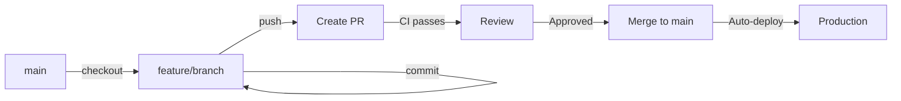

# Branching Strategy

**Last Updated:** November 10, 2025

## Overview

This project uses **GitHub Flow** - a simple, effective branching strategy perfect for continuous deployment.

## Branch Structure

```
main (protected)
  ├── feature/feature-name
  ├── fix/bug-description
  ├── chore/task-description
  └── dependabot/*
```

## Branch Types

### 1. **`main`** - Production Branch
- **Purpose:** Production-ready code only
- **Protection:**
  - ✅ Requires pull requests (no direct commits)
  - ✅ Requires "CI Success" check to pass
  - ✅ Auto-deploys to production
- **Deploy:** Automatic via GitHub Actions

### 2. **Feature Branches** - `feature/*`
- **Purpose:** New features or enhancements
- **Naming:** `feature/add-dark-mode`, `feature/ai-improvements`
- **Lifetime:** Short-lived (delete after merge)
- **Workflow:**
  ```bash
  git checkout main
  git pull
  git checkout -b feature/your-feature-name
  # Make changes
  git push -u origin feature/your-feature-name
  # Create PR to main
  ```

### 3. **Fix Branches** - `fix/*`
- **Purpose:** Bug fixes
- **Naming:** `fix/location-context-tests`, `fix/axios-mock-error`
- **Lifetime:** Short-lived (delete after merge)
- **Workflow:**
  ```bash
  git checkout main
  git pull
  git checkout -b fix/bug-description
  # Fix the bug
  git push -u origin fix/bug-description
  # Create PR to main
  ```

### 4. **Chore Branches** - `chore/*`
- **Purpose:** Maintenance, refactoring, dependency updates
- **Naming:** `chore/update-deps`, `chore/refactor-tests`
- **Lifetime:** Short-lived (delete after merge)

### 5. **Dependabot Branches** - `dependabot/*`
- **Purpose:** Automated dependency updates
- **Naming:** Auto-generated by Dependabot
- **Workflow:** Auto-created, review & merge when CI passes

## Workflow

### Standard Development Flow



### Step-by-Step

1. **Start New Work**
   ```bash
   git checkout main
   git pull origin main
   git checkout -b feature/your-feature
   ```

2. **Make Changes**
   ```bash
   git add .
   git commit -m "feat: your change description"
   ```

3. **Push to Remote**
   ```bash
   git push -u origin feature/your-feature
   ```

4. **Create Pull Request**
   ```bash
   gh pr create --title "feat: Your Feature" --body "Description..."
   ```

5. **Wait for CI**
   - All checks must pass
   - Fix any failures before merging

6. **Merge**
   ```bash
   gh pr merge --squash --delete-branch
   ```

7. **Cleanup**
   ```bash
   git checkout main
   git pull
   git branch -d feature/your-feature
   ```

## Branch Protection Rules

### Main Branch (`main`)
- ✅ **Require pull request reviews:** No approvals needed (single developer)
- ✅ **Require status checks:** CI Success must pass
- ✅ **Require branches to be up to date:** Prevent merge conflicts
- ✅ **Dismiss stale reviews:** New commits invalidate approvals
- ❌ **No force pushes:** Prevents history rewriting
- ❌ **No deletions:** Prevents accidental branch deletion

## Dependabot Strategy

### Current Setup
- Dependabot creates PRs automatically
- Each PR triggers full CI pipeline
- Manual review and merge

### Recommended Improvements

1. **Auto-merge Patch Updates**
   ```yaml
   # .github/dependabot.yml
   version: 2
   updates:
     - package-ecosystem: "npm"
       directory: "/frontend"
       schedule:
         interval: "weekly"
       open-pull-requests-limit: 5  # Limit concurrent PRs
   ```

2. **Group Related Updates**
   - Group testing libraries together
   - Group React ecosystem together
   - Reduces PR count from 13 → 3-4

3. **Merge Strategy**
   - Merge 1-2 PRs at a time, not all at once
   - Prevents queue congestion (20-job concurrency limit)

## CI/CD Integration

### Current Workflow Triggers

```yaml
on:
  push:
    branches: [ main ]
  pull_request:
    branches: [ main ]
```

### What Runs When

| Event | Workflows | Auto-Deploy |
|-------|-----------|-------------|
| Push to `main` | CI + Deploy + Security | ✅ Yes |
| PR to `main` | CI + Security | ❌ No |
| PR Comment | PR feedback | ❌ No |

### Concurrency Protection

```yaml
concurrency:
  group: ${{ github.workflow }}-${{ github.ref }}
  cancel-in-progress: true
```

This prevents multiple runs from the same branch running simultaneously.

## Common Scenarios

### Scenario 1: Working on a Feature

```bash
# Start
git checkout -b feature/add-export-feature

# Work
git commit -m "feat: add export button"
git commit -m "feat: add export logic"
git commit -m "test: add export tests"

# Push and create PR
git push -u origin feature/add-export-feature
gh pr create --title "feat: Add export feature"

# After merge
git checkout main
git pull
git branch -d feature/add-export-feature
```

### Scenario 2: Fixing a Bug

```bash
# Quick fix
git checkout -b fix/broken-chart
git commit -m "fix: correct chart axis labels"
git push -u origin fix/broken-chart
gh pr create --title "fix: Correct chart axis labels"
```

### Scenario 3: Multiple Dependabot PRs

```bash
# DON'T: Update all branches at once (causes queue congestion)
gh pr list --author dependabot | xargs gh pr update

# DO: Merge them one at a time
gh pr merge 15 --squash --delete-branch
# Wait for deployment
gh pr merge 14 --squash --delete-branch
# Wait for deployment
# ...
```

### Scenario 4: Emergency Hotfix

```bash
# If main is protected and you need to fix prod immediately:
git checkout -b hotfix/critical-bug
git commit -m "fix: critical security issue"
git push -u origin hotfix/critical-bug
gh pr create --title "HOTFIX: Critical security fix"
# Merge immediately (bypass protection if needed)
gh pr merge --admin --squash
```

## Best Practices

### ✅ DO
- Create descriptive branch names
- Delete branches after merging
- Keep PRs small and focused
- Write clear commit messages
- Run tests locally before pushing
- Merge PRs one at a time to avoid queue congestion

### ❌ DON'T
- Commit directly to main (once protected)
- Leave old branches hanging around
- Create mega-PRs with 50+ file changes
- Force push to shared branches
- Update all Dependabot PRs simultaneously

## Git Aliases (Optional)

Add these to your `~/.gitconfig` for faster workflows:

```ini
[alias]
    new = "!f() { git checkout main && git pull && git checkout -b $1; }; f"
    update = "!git fetch origin && git rebase origin/main"
    done = "!f() { git checkout main && git pull && git branch -d $1; }; f"
    pr = "!gh pr create --web"
```

Usage:
```bash
git new feature/my-feature  # Create new feature branch
git update                   # Update branch with main
git done feature/my-feature  # Cleanup after merge
git pr                       # Open PR in browser
```

## Troubleshooting

### "Branch protection prevents merge"
**Solution:** Ensure CI Success check has passed on your PR

### "Conflict with main"
**Solution:** Update your branch
```bash
git fetch origin
git rebase origin/main
# Resolve conflicts
git push --force-with-lease
```

### "Too many CI runs in queue"
**Solution:** Cancel unnecessary runs
```bash
gh run list --status queued --json databaseId --jq '.[].databaseId' | xargs -I {} gh run cancel {}
```

## References

- [GitHub Flow Guide](https://docs.github.com/en/get-started/quickstart/github-flow)
- [Branch Protection Rules](https://docs.github.com/en/repositories/configuring-branches-and-merges-in-your-repository/defining-the-mergeability-of-pull-requests/about-protected-branches)
- [Dependabot Configuration](https://docs.github.com/en/code-security/dependabot/dependabot-version-updates/configuration-options-for-the-dependabot.yml-file)

---

**Questions?** Open an issue or check the [Developer Guide](AGENTS.md)
